# SSRF Attack Lab

Educational security lab demonstrating a vulnerable Node.js API affected by SSRF.

## Architecture

  

## Goals

- Demonstrate reconnaissance techniques
- Exploit an Information Disclosure vulnerability
- Perform SSRF exploitation
- Map the attack chain to MITRE ATT&CK
- Implement mitigation strategies

## Status

🚧 Work in progress
